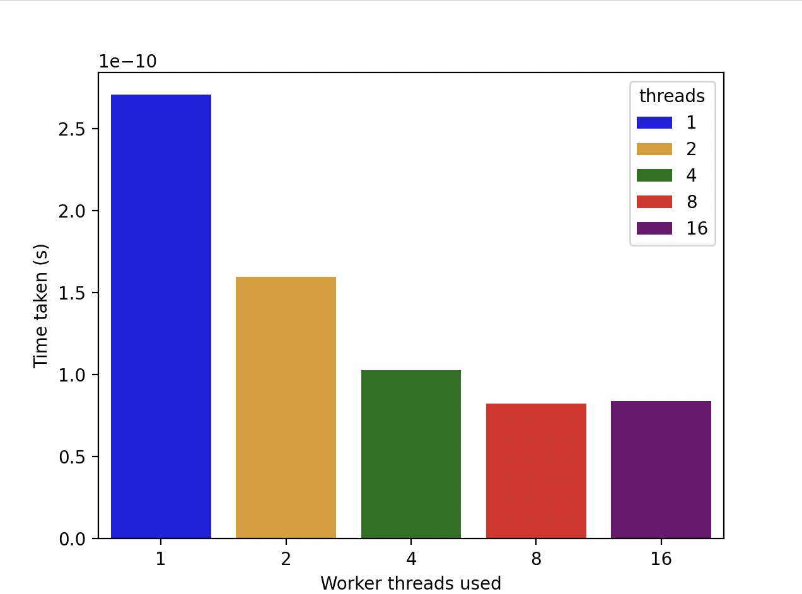

### Question 1a

See `filter/medianFilter.go`

### Question 1b

See `worker` in `filter/medianFilter.go`

### Question 1c

See `filter` in `filter/medianFilter.go`

### Question 1d

  

### Question 1e

To evaluate performance improvements from parallelisation, we used Go benchmarks, varying worker threads and measuring Median Filter runtimes. Tests used `ship.png` input, and were run 5 times on a quad-core 2022 M2 MacBook Air. 

Our implementation shows performance improvements as more goroutines are used. With 16 workers, the filter was 1.88x faster than with 2. Scaling occurs due to the parallelizable workload that can divide the image into independently filtered regions, so more workers means more regions can be worked on concurrently.

Our implementation shows performance improvements as more worker goroutine are used. With 16 worker threads, the filter was 1.88x faster than the implementation with 2 workers. The scaling we see occurs due to the parallelizable nature of the workload (image) that can be divided into separate regions that are filtered independently, thus adding more workers means more regions can be worked on concurrently which improves the throughput.

However, We see the most dramatic improvements from 2 to 4 workers, beyond which improvements level off. This is because the image input/output is not parallelizable, and our program is hardware limited - a quad-core CPU means only 4 concurrent computations, so beyond 4 workers, goroutines timeshare the 4 CPUs, and beyond 8 workers, the CPU becomes saturated, and goroutine switching overhead outweighs gains from more workers.

In summary, our Median Filter demonstrates good scaling to CPU cores, showing goroutines/channels efficiently parallelise image processing, but are ultimately hardware limited.

### Question 1f

`go tool trace trace.out`